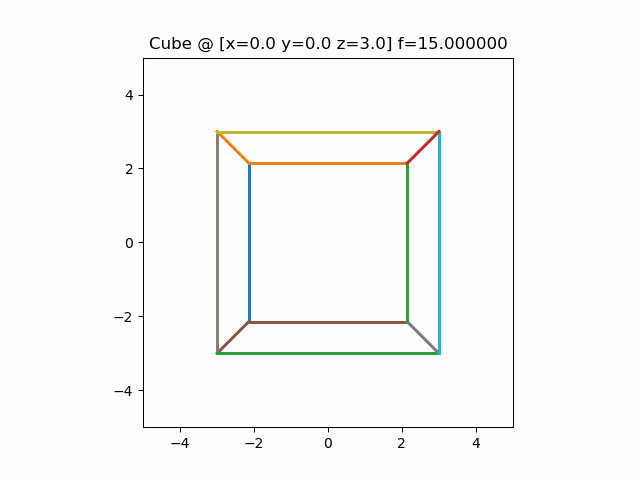

# 3D Cube Rotation Animation

A visualization of a 3D cube rotating around the y-axis using rotation matrices. The animation demonstrates linear algebra principles applied to computer graphics.

## Project Description
- Implements a `rotY(theta)` function that computes the 3D rotation matrix for y-axis rotations
- Follows the right-hand rule (positive theta = counterclockwise rotation)
- Generates a smooth animation of a cube rotating about its vertical axis
- Outputs the animation as a GIF file (`cube.gif`)

## Technical Details
- **Rotation Matrix**: Uses standard y-axis rotation from linear algebra
- **Animation**: Rendered frame-by-frame using Matplotlib's 3D capabilities
- **Parameters**: Adjustable rotation speed and smoothness via frame count

## Requirements
- Python 3.x
- NumPy
- Matplotlib

## Usage
1. Install dependencies: `pip install numpy matplotlib`
2. Run the script to generate `cube.gif`
3. (Optional) Modify rotation parameters in the code

The resulting animation shows a wireframe cube performing a continuous smooth rotation.